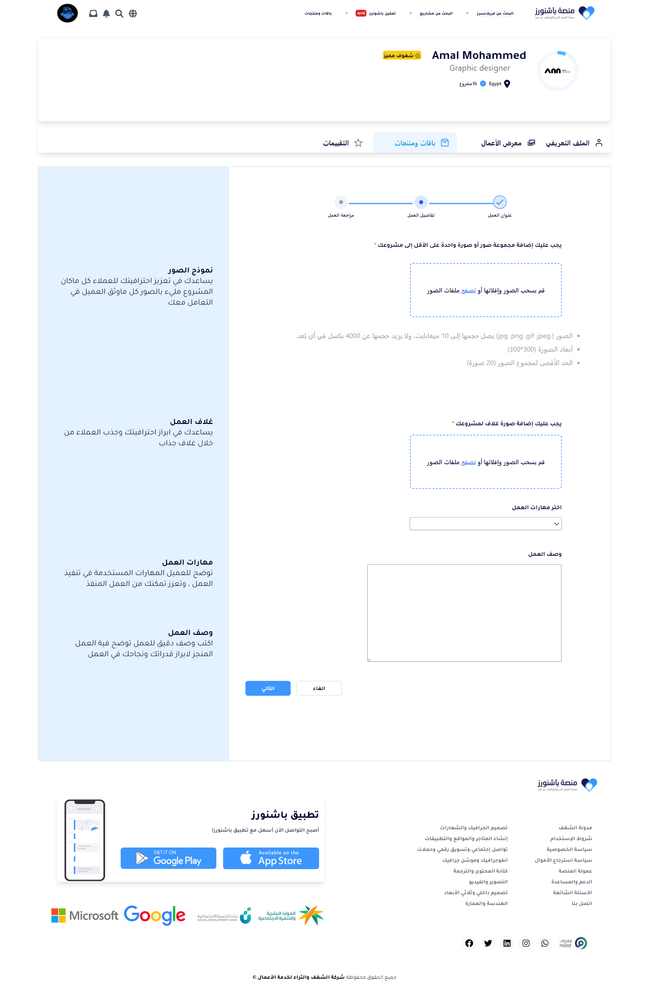
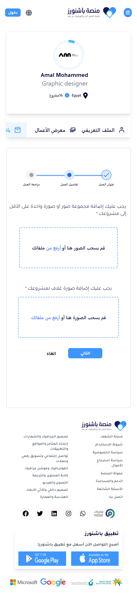

# Passioneurs Website Page
## Description
A project to demonstrate front-end skills using vanilla HTML and JS and TailwindCSS to build a web page for Passioneurs website based on the received Figma design

### Live Demo Link:
https://loody170.github.io/passioneurs-website-page

## Images
### Desktop View

### Mobile View

